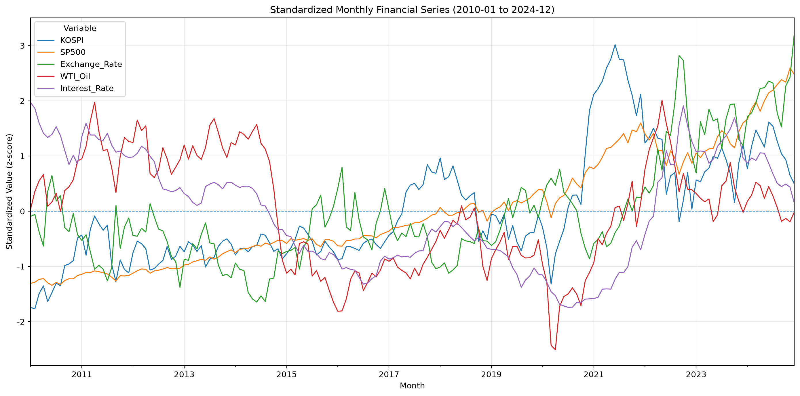
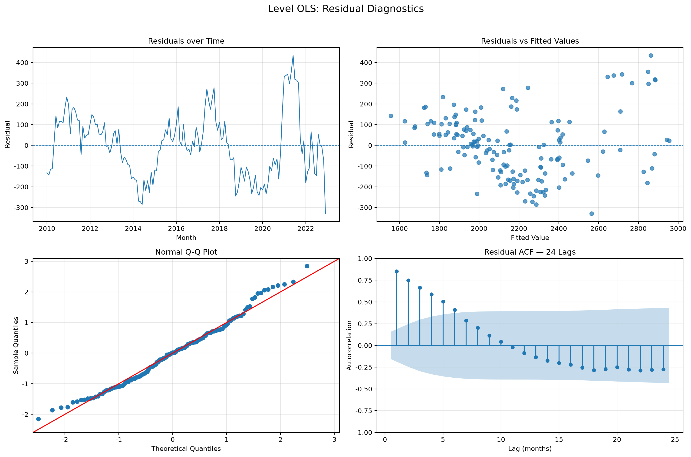
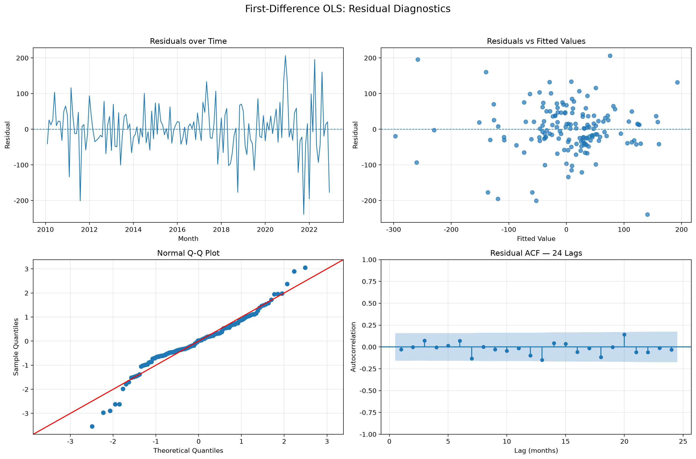
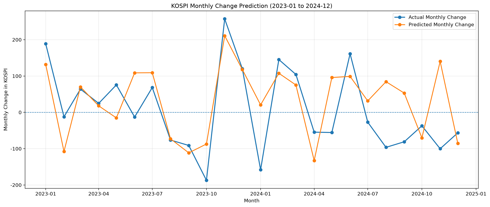
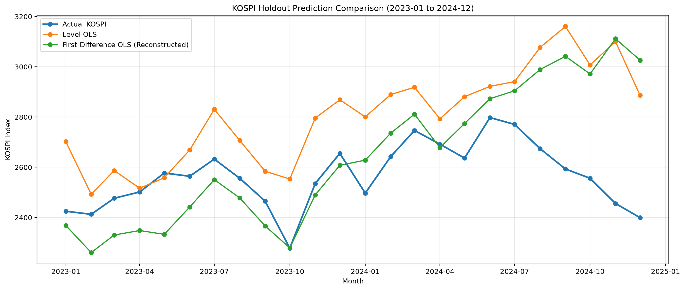
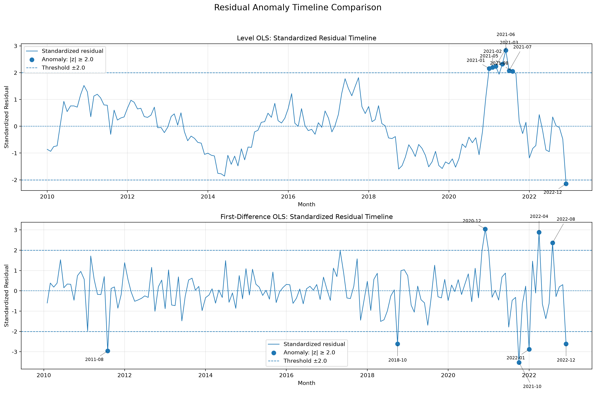

# KOSPI 거시경제 변수 분석: 정상성 진단과 허위회귀 검증

> 비정상 금융 시계열의 허위회귀 위험을 진단하고, 1차 차분·공적분 검정·HAC 강건 추론·시계열 홀드아웃 평가를 통해 KOSPI와 주요 금융 변수의 단기 연관성을 분석한 프로젝트

---

## 1. 프로젝트 개요

본 프로젝트는 **2010년 1월부터 2024년 12월까지의 월별 금융 시계열 데이터**를 활용해 KOSPI와 주요 거시·금융 변수 사이의 관계를 분석한 프로젝트입니다.

단순히 높은 결정계수를 가진 회귀모형을 제시하는 데 그치지 않고, 금융 시계열 분석에서 자주 발생하는 다음 문제를 단계적으로 진단했습니다.

* 비정상성
* 허위회귀
* 잔차 자기상관
* 이분산성
* 잔차 비정규성
* 다중공선성
* 공적분 부재
* 극단적인 잔차
* 차분 예측값 누적에 따른 오차 확대

분석의 핵심은 **수준 OLS의 높은 설명력을 그대로 신뢰하지 않고**, 정상성이 확보된 1차 차분 모형과 HAC 강건 표준오차를 통해 분석 결과의 통계적 타당성을 점검했다는 점입니다.

본 프로젝트에서 추정된 회귀계수는 인과효과가 아니라 **동일 월에 관측된 금융 변수 변화와 KOSPI 변화 사이의 조건부 통계적 연관성**으로 해석합니다.

---

## 2. 핵심 분석 질문

본 프로젝트는 다음 질문에 답하는 것을 목표로 합니다.

1. KOSPI와 주요 금융 변수의 수준값은 정상 시계열인가?
2. 수준 OLS의 높은 결정계수는 통계적으로 신뢰할 수 있는가?
3. 수준 변수 사이에 장기 균형관계인 공적분이 존재하는가?
4. 1차 차분 후 잔차 자기상관이 완화되는가?
5. 이분산성을 고려한 HAC 추론에서도 유의한 변수가 유지되는가?
6. 차분 모형은 홀드아웃 구간의 KOSPI 월간 변화와 방향을 어느 정도 설명하는가?
7. 차분 예측값을 KOSPI 수준으로 복원했을 때 수준 OLS보다 개선되는가?
8. 현재 선형모형이 충분히 설명하지 못한 이상 시점은 언제인가?

---

## 3. 데이터 구성

### 3.1 분석 기간 및 표본

| 항목        | 내용                   |
| --------- | -------------------- |
| 분석 기간     | 2010년 1월 ~ 2024년 12월 |
| 관측 단위     | 월별                   |
| 수준 데이터    | 180행 × 5열            |
| 1차 차분 데이터 | 179행 × 5열            |
| 최종 결측치    | 0개                   |
| 학습 기간     | 2010년 1월 ~ 2022년 12월 |
| 홀드아웃 기간   | 2023년 1월 ~ 2024년 12월 |
| 홀드아웃 표본   | 24개월                 |

### 3.2 변수

| 구분   | 변수명             | 설명              | 출처            |
| ---- | --------------- | --------------- | ------------- |
| 종속변수 | `KOSPI`         | KOSPI 월말 종가     | Yahoo Finance |
| 설명변수 | `Exchange_Rate` | 원/달러 환율 월말값     | Yahoo Finance |
| 설명변수 | `Interest_Rate` | 국고채 3년 월별 금리    | 한국은행 ECOS     |
| 설명변수 | `SP500`         | S&P 500 월말 종가   | Yahoo Finance |
| 설명변수 | `WTI_Oil`       | WTI 원유 선물 월말 종가 | Yahoo Finance |

Yahoo Finance에서 수집한 일별 금융 데이터는 각 월의 **마지막 유효 거래일 종가**로 변환했습니다.

국고채 3년 금리는 한국은행 ECOS에서 내려받은 월별 CSV를 파싱해 사용했습니다.

### 3.3 변수 선정 근거

설명변수는 임의로 투입하지 않고, KOSPI 월간 변동에 영향을 주는 경제적 채널을 사전에 가정한 뒤 선정했습니다. 각 변수의 예상 부호와 실증 결과(11장 HAC 추론)는 다음과 같습니다.

| 변수 | 경제적 채널 | 예상 부호 | HAC 계수 | HAC p-value | 가설 일치 |
| --- | --- | --- | --- | --- | --- |
| `SP500` | 글로벌 증시 동조화와 위험선호의 대표 지표로, 외국인 자금과 투자심리 경로를 통해 KOSPI와 연동 | + | +0.464 | < 0.000001 | 일치 (강하게 유의) |
| `Exchange_Rate` | 원화 약세 시 외국인 환차손과 자금 유출, 위험회피 국면의 달러 강세가 주가 하락과 동조 | − | −0.562 | 0.009472 | 일치 (유의) |
| `Interest_Rate` | 금리 상승 시 할인율 상승으로 미래 현금흐름의 현재가치 하락, 채권 대비 주식의 상대 매력 저하 | − | −78.579 | 0.070881 | 부호 일치 (유의성 약함) |
| `WTI_Oil` | 경기·수요 신호(+)와 수입물가·기업비용(−)이 충돌. 한국은 원유 순수입국으로 사전 부호 불명확 | ± (불명확) | +2.477 | 0.000069 | 경기·위험선호 채널 우세 |

- `SP500`: 사전 가설과 실증이 가장 명확하게 일치하며, 동시점 월간 변화에서 가장 강한 설명력을 보였습니다. 이는 KOSPI 단기 변동이 글로벌 위험선호에 크게 좌우됨을 시사합니다.
- `Exchange_Rate`: 원화 약세는 수출기업 실적에 긍정적일 수 있으나(수출 채널, +), 외국인 자금흐름과 위험선호 채널(−)이 우세하리라 예상했고, 실제로 음의 유의한 관계로 확인되었습니다.
- `Interest_Rate`: 부호는 예상(−)과 일치했지만, 일반 OLS에서 유의했던 금리 변수가 HAC 적용 후 5% 수준에서 유의성을 잃었습니다. 이는 잔차 자기상관을 보정하면 금리의 단기 설명력이 과대평가되었음을 보여주는 사례입니다.
- `WTI_Oil`: 유일하게 사전 부호를 단정하지 않은 변수입니다. 비용 채널(−)과 경기 채널(+)이 충돌하나, 실증 결과 양의 유의한 관계가 나타나 동시점 월간 변화에서는 유가가 글로벌 경기·위험선호의 대리지표로 작동했음을 시사합니다.

종합하면 4개 변수 중 3개(`SP500`, `Exchange_Rate`, `WTI_Oil`)가 사전 가설과 일치했고, 금리는 부호는 맞으나 강건추론에서 유의성이 약화되었습니다. 이는 변수를 임의로 투입한 것이 아니라 경제적 가설을 세우고 검정으로 확인·기각하는 과정을 거쳤음을 보여줍니다.

---

## 4. 분석 파이프라인

프로젝트는 다음 순서로 구성됩니다.

1. 금융시장 데이터 수집
2. 한국은행 금리 데이터 파싱
3. 일별 데이터를 월별 데이터로 변환
4. 변수 병합 및 데이터 품질 검증
5. 재구축 전·후 데이터 비교
6. 수준 및 차분 시계열 정상성 검정
7. 수준 OLS 적합 및 허위회귀 위험 진단
8. Engle–Granger 공적분 검정
9. 1차 차분 OLS 적합
10. 잔차 및 다중공선성 진단
11. HAC 강건 표준오차 추론
12. 시계열 홀드아웃 평가
13. 차분 예측값의 KOSPI 수준 경로 복원
14. 표준화 잔차 기반 이상 시점 탐지
15. 결과표·그래프·보고서 자동 저장

---

## 5. 데이터 재구축 및 품질 검증

재구축 이전 데이터는 다음 경로에 기준 데이터로 보존했습니다.

```text
data/reference/kospi_macro_monthly_legacy.csv
```

현재 분석 데이터와 기준 데이터를 월별·변수별로 비교한 결과는 다음과 같습니다.

| 변수        | 변경 월 수 | 평균 절대 차이 |  최대 절대 차이 |
| --------- | -----: | -------: | --------: |
| KOSPI     |      0 | 0.000000 |  0.000000 |
| S&P 500   |      0 | 0.000000 |  0.000000 |
| 원/달러 환율   |     42 | 2.165223 | 43.099976 |
| WTI 유가    |     26 | 0.758889 | 24.279999 |
| 국고채 3년 금리 |      0 | 0.000000 |  0.000000 |

총 **68개의 값**이 변경되었습니다.

* 원/달러 환율: 42개월
* WTI 유가: 26개월
* KOSPI: 변경 없음
* S&P 500: 변경 없음
* 국고채 3년 금리: 변경 없음

변경 내역은 다음 파일에 저장됩니다.

```text
outputs/metrics/data_regeneration_comparison_summary.csv
outputs/metrics/data_regeneration_changed_values.csv
```

기준 데이터는 데이터 수정 이력을 검증하기 위한 감사 자료이며, 회귀모형의 입력 데이터로 직접 사용하지 않습니다.



---

## 6. 분석 방법

### 6.1 정상성 진단

각 수준 변수와 1차 차분 변수에 다음 검정을 적용했습니다.

* Augmented Dickey–Fuller 검정
* KPSS 검정
* 시계열 그래프
* 자기상관함수 ACF

검정의 귀무가설은 다음과 같습니다.

| 검정   | 귀무가설                |
| ---- | ------------------- |
| ADF  | 단위근이 존재하며 비정상 시계열이다 |
| KPSS | 정상 시계열이다            |

두 검정 결과를 함께 고려해 최종 정상성 여부를 판정했습니다.

### 6.2 수준 OLS

$$\mathrm{KOSPI}_t = \beta_0 + \beta_1\mathrm{Exchange}_t + \beta_2\mathrm{Interest}_t + \beta_3\mathrm{SP500}_t + \beta_4\mathrm{WTI}_t + \varepsilon_t$$

수준 모형은 비정상 금융 시계열에서 발생할 수 있는 **허위회귀 위험을 확인하는 비교·진단 모형**으로 사용했습니다.

### 6.3 1차 차분 OLS

$$\Delta\mathrm{KOSPI}_t = \beta_0 + \beta_1\Delta\mathrm{Exchange}_t + \beta_2\Delta\mathrm{Interest}_t + \beta_3\Delta\mathrm{SP500}_t + \beta_4\Delta\mathrm{WTI}_t + \varepsilon_t$$

차분 모형은 정상성이 확보된 월간 변화량 사이의 단기 연관성을 분석하는 주 모형입니다.

### 6.4 학습 및 평가 설계

시계열 순서를 유지하기 위해 무작위 분할을 사용하지 않았습니다.

| 모형        | 학습 기간             | 학습 표본 | 홀드아웃 표본 |
| --------- | ----------------- | ----: | ------: |
| 수준 OLS    | 2010-01 ~ 2022-12 | 156개월 |    24개월 |
| 1차 차분 OLS | 2010-02 ~ 2022-12 | 155개월 |    24개월 |

홀드아웃 기간은 2023년 1월부터 2024년 12월까지입니다.

---

## 7. 정상성 검정 결과

| 변수        | 수준 시계열 | 1차 차분 |
| --------- | ------ | ----- |
| KOSPI     | 비정상    | 정상    |
| S&P 500   | 비정상    | 정상    |
| 원/달러 환율   | 비정상    | 정상    |
| 국고채 3년 금리 | 비정상    | 정상    |
| WTI 유가    | 판정 불일치 | 정상    |

KOSPI, S&P 500, 원/달러 환율 및 국고채 금리는 수준 상태에서 비정상성이 확인되었습니다.

WTI는 수준 상태에서 ADF와 KPSS의 판정이 일치하지 않았지만, 1차 차분 후에는 모든 변수가 정상 시계열로 판정되었습니다.

따라서 수준 OLS의 높은 설명력을 그대로 해석하지 않고, 1차 차분 OLS를 주 분석 모형으로 사용했습니다.

세부 검정 결과는 다음 파일에서 확인할 수 있습니다.

```text
outputs/metrics/stationarity_level_tests.csv
outputs/metrics/stationarity_first_difference_tests.csv
outputs/metrics/stationarity_decision_summary.csv
outputs/reports/stationarity_findings.md
```

---

## 8. 수준 OLS 진단

| 지표                    |            결과 |
| --------------------- | ------------: |
| 학습 표본                 |           156 |
| R²                    |      0.810265 |
| 수정 R²                 |      0.805239 |
| Durbin–Watson         |      0.261111 |
| Ljung–Box p-value     |    < 0.000001 |
| Breusch–Pagan p-value |      0.000001 |
| Jarque–Bera p-value   |      0.195416 |
| 조건수                   | 61,544.390850 |
| 최대 VIF                |      5.783620 |

수준 OLS는 학습 구간에서 높은 결정계수를 보였습니다.

그러나 다음 문제가 함께 확인되었습니다.

* 수준 변수의 비정상성
* 강한 양의 잔차 자기상관
* 이분산성
* 높은 조건수
* 공적분 근거 부재
* 2021년에 집중된 연속적인 양의 이상 잔차

따라서 수준 OLS의 높은 R²와 유의한 계수를 장기 균형관계나 인과관계의 근거로 해석하지 않습니다.



---

## 9. Engle–Granger 공적분 검정

수준 모형의 학습 구간에 Engle–Granger 공적분 검정을 적용했습니다.

| 항목      |        결과 |
| ------- | --------: |
| 검정통계량   | -2.995277 |
| p-value |  0.590111 |
| 1% 임계값  | -5.100654 |
| 5% 임계값  | -4.506297 |
| 10% 임계값 | -4.201029 |

p-value가 0.05보다 크므로 공적분 관계가 없다는 귀무가설을 기각하지 못했습니다.

검정통계량도 1%, 5%, 10% 임계값보다 충분히 작지 않았습니다.

따라서 수준 변수 사이에 안정적인 장기 균형관계가 존재한다고 보기 어렵습니다. 이는 수준 OLS의 높은 결정계수가 허위회귀 위험을 포함할 수 있다는 해석을 뒷받침합니다.

---

## 10. 1차 차분 OLS 진단

| 지표                    |         결과 |
| --------------------- | ---------: |
| 학습 표본                 |        155 |
| R²                    |   0.561996 |
| 수정 R²                 |   0.550316 |
| Durbin–Watson         |   2.010219 |
| Ljung–Box p-value     |   0.859924 |
| Breusch–Pagan p-value |   0.009529 |
| Jarque–Bera p-value   |   0.000006 |
| 조건수                   | 889.253160 |
| 최대 VIF                |   1.325317 |

1차 차분 후에는 Durbin–Watson 통계량이 약 2로 개선되었습니다.

Ljung–Box 검정에서도 잔차 자기상관이 발견되지 않았습니다.

다만 다음 문제는 남아 있었습니다.

* Breusch–Pagan 검정에서 이분산성 확인
* Jarque–Bera 검정에서 비정규성 확인
* 일부 월에 큰 잔차 존재

이에 따라 최종 계수 추론에는 일반 OLS 표준오차가 아니라 **HAC(Newey–West) 강건 표준오차**를 사용했습니다.



---

## 11. HAC 강건 추론 결과

최대 시차 12개월의 HAC 표준오차를 적용했습니다.

| 변수         |         계수 |  HAC 표준오차 |    p-value |                95% 신뢰구간 | 5% 유의성  |
| ---------- | ---------: | --------: | ---------: | ----------------------: | ------- |
| 절편         |  -4.277118 |  5.212478 |   0.413203 |  [-14.576481, 6.022245] | 유의하지 않음 |
| 원/달러 환율 변화 |  -0.561855 |  0.213766 |   0.009472 |  [-0.984237, -0.139473] | 유의      |
| 금리 변화      | -78.578855 | 43.195111 |   0.070881 | [-163.928304, 6.770595] | 유의하지 않음 |
| S&P 500 변화 |   0.464325 |  0.056959 | < 0.000001 |    [0.351779, 0.576870] | 유의      |
| WTI 변화     |   2.476767 |  0.604860 |   0.000069 |    [1.281620, 3.671913] | 유의      |

HAC 기준으로 다음 결과가 확인되었습니다.

* 원/달러 환율 상승은 KOSPI 변화와 유의한 음의 관계
* S&P 500 상승은 KOSPI 변화와 유의한 양의 관계
* WTI 상승은 KOSPI 변화와 유의한 양의 관계
* 금리 변화는 일반 OLS에서는 5% 수준에서 유의했지만 HAC 적용 후에는 유의하지 않음

이는 일반 OLS 표준오차만 사용할 경우 금리 변수의 유의성이 과대평가될 수 있음을 보여줍니다.

모든 결과는 동시점 월간 변화량 사이의 통계적 연관성이며 인과효과를 의미하지 않습니다.

---

## 12. 홀드아웃 평가

### 12.1 수준 OLS

| 지표   |          결과 |
| ---- | ----------: |
| MAE  |  239.032400 |
| RMSE |  289.290943 |
| R²   |   -4.367919 |
| 평균오차 | -237.446765 |

수준 OLS는 2023~2024년 홀드아웃 구간에서 KOSPI 수준을 지속적으로 과대예측하는 경향을 보였습니다.

본 프로젝트의 평균오차는 다음과 같이 정의했습니다.

$$\mathrm{Mean\ Error} = \frac{1}{n}\sum_{t=1}^{n}(y_t-\hat{y}_t)$$

따라서 음수 평균오차는 예측값이 실제값보다 전반적으로 높았음을 의미합니다.

### 12.2 1차 차분 OLS

| 지표     |         결과 |
| ------ | ---------: |
| MAE    |  75.176237 |
| RMSE   |  98.046746 |
| R²     |   0.230724 |
| 평균오차   | -26.110992 |
| 방향 정확도 |     66.67% |

차분 모형은 홀드아웃 구간에서 월간 KOSPI 변화 방향을 약 66.7% 맞혔습니다.

변화량은 0에 가깝거나 음수가 될 수 있으므로 MAPE 대신 다음 지표를 사용했습니다.

* MAE
* RMSE
* R²
* 방향 정확도



### 12.3 동일한 KOSPI 수준 척도 비교

수준 OLS의 예측값과 차분 OLS의 예측값은 원래 단위가 다르므로 직접 비교할 수 없습니다.

이에 따라 차분 모형의 예측 변화량을 2022년 12월의 실제 KOSPI 수준에 누적해 KOSPI 수준 경로로 복원했습니다.

$$\widehat{\mathrm{KOSPI}}*t = \mathrm{KOSPI}*{2022\text{-}12} + \sum_{s=2023\text{-}01}^{t}\widehat{\Delta\mathrm{KOSPI}}_s$$

| 모형           |        MAE |       RMSE |        R² |        평균오차 |
| ------------ | ---------: | ---------: | --------: | ----------: |
| 수준 OLS       | 239.032400 | 289.290943 | -4.367919 | -237.446765 |
| 차분 OLS 수준 복원 | 180.788683 | 253.408947 | -3.118890 |  -77.382201 |

차분 복원 모형은 수준 OLS 대비 다음과 같이 개선되었습니다.

* MAE 약 24.4% 감소
* RMSE 약 12.4% 감소
* 절대 평균 편향 약 67.4% 감소

다만 두 수준 예측 모형 모두 R²가 0보다 작았습니다.

따라서 홀드아웃 구간의 KOSPI 수준 경로를 단순 평균 기준보다 잘 예측했다고 보기는 어렵습니다.

본 프로젝트의 핵심 성과는 높은 주가지수 예측 정확도가 아니라, **비정상 금융 시계열의 분석 타당성을 점검하고 개선한 과정**에 있습니다.



---

## 13. 표준화 잔차 기반 이상 시점 탐지

잔차는 다음과 같이 표준화했습니다.

$$z_t = \frac{\varepsilon_t-\bar{\varepsilon}}{s_{\varepsilon}}$$

이상 시점 기준은 다음과 같습니다.

$$|z_t| \ge 2.0$$

| 모형        | 이상 시점 수 | 전체 학습 표본 |     비율 |
| --------- | ------: | -------: | -----: |
| 수준 OLS    |       8 |      156 | 약 5.1% |
| 1차 차분 OLS |       8 |      155 | 약 5.2% |

### 13.1 수준 OLS 이상 시점

* 2021년 1월
* 2021년 2월
* 2021년 3월
* 2021년 5월
* 2021년 6월
* 2021년 7월
* 2021년 8월
* 2022년 12월

수준 OLS의 이상 잔차는 2021년에 연속적으로 집중되었습니다.

이는 독립적인 개별 충격보다 모형의 지속적인 과소예측과 강한 잔차 자기상관을 보여주는 패턴입니다.

### 13.2 1차 차분 OLS 이상 시점

* 2011년 8월
* 2018년 10월
* 2020년 12월
* 2021년 10월
* 2022년 1월
* 2022년 4월
* 2022년 8월
* 2022년 12월

차분 모형의 이상 잔차는 여러 시점에 산발적으로 분포했습니다.

이는 장기적인 잔차 자기상관보다는 급격한 시장 변동과 두꺼운 꼬리의 영향을 시사합니다.

이상 시점은 데이터 오류를 의미하지 않으며, 현재 설명변수와 선형모형만으로 충분히 설명되지 않은 관측치 후보입니다.



---

## 14. 주요 결론

### 14.1 수준 OLS

수준 OLS는 높은 R²를 보였지만 다음 문제가 동시에 확인되었습니다.

* 비정상 수준 변수
* 강한 잔차 자기상관
* 이분산성
* 공적분 근거 부재
* 특정 기간에 집중된 잔차 군집

따라서 수준 OLS는 장기 경제관계를 설명하는 최종 모형이 아니라, **허위회귀 위험을 보여주는 비교·진단 모형**으로 해석해야 합니다.

### 14.2 1차 차분 OLS

1차 차분 후에는 모든 변수의 정상성이 확보되었고 잔차 자기상관도 해소되었습니다.

다만 이분산성과 비정규성이 남아 있어 HAC 표준오차를 적용했습니다.

HAC 기준으로 다음 변수가 유의했습니다.

* 원/달러 환율 변화: 음의 관계
* S&P 500 변화: 양의 관계
* WTI 변화: 양의 관계

금리 변화는 HAC 적용 후 5% 수준에서 유의하지 않았습니다.

### 14.3 예측 성능

차분 모형은 월간 변화량 예측에서 양의 R²와 66.7%의 방향 정확도를 보였습니다.

차분 예측값을 수준 경로로 복원했을 때 수준 OLS보다 오차가 감소했지만, 수준 경로 기준 R²는 여전히 0보다 작았습니다.

따라서 본 프로젝트는 고성능 주가지수 예측모형이 아니라, **금융 시계열 분석에서 모형 진단과 통계적 타당성 확보가 왜 중요한지를 보여주는 프로젝트**입니다.

---

## 15. 프로젝트 구조

```text
.
├── README.md
├── config.yaml
├── requirements.txt
├── .gitignore
│
├── data
│   ├── raw
│   │   ├── README.md
│   │   └── interest_rate.csv
│   ├── reference
│   │   └── kospi_macro_monthly_legacy.csv
│   └── processed
│       ├── kospi_macro_monthly.csv
│       └── kospi_macro_monthly_diff.csv
│
├── notebooks
│   ├── 01_data_collection_cleaning.ipynb
│   ├── 02_stationarity_diagnostics.ipynb
│   └── 03_modeling_evaluation.ipynb
│
├── outputs
│   ├── figures
│   ├── metrics
│   └── reports
│
└── docs
    ├── portfolio_description.md
    └── submission_manifest.md
```

---

## 16. 노트북별 역할

| 순서 | 노트북                                 | 핵심 역할                                                       |
| -: | ----------------------------------- | ----------------------------------------------------------- |
|  1 | `01_data_collection_cleaning.ipynb` | 금융 데이터 수집, 금리 CSV 파싱, 월별 집계, 데이터 병합, 재생성 비교 및 품질 검증         |
|  2 | `02_stationarity_diagnostics.ipynb` | 수준·차분 시계열의 ADF·KPSS 검정, ACF 분석, 차분 데이터 생성                   |
|  3 | `03_modeling_evaluation.ipynb`      | 수준·차분 OLS, 공적분·잔차·VIF 진단, HAC 추론, 홀드아웃 평가, 수준 복원 및 이상 시점 탐지 |

---

## 17. 주요 산출물

### 17.1 데이터 품질 및 정상성

```text
outputs/reports/data_quality_summary.csv
outputs/metrics/data_regeneration_comparison_summary.csv
outputs/metrics/data_regeneration_changed_values.csv
outputs/metrics/stationarity_level_tests.csv
outputs/metrics/stationarity_first_difference_tests.csv
outputs/metrics/stationarity_decision_summary.csv
outputs/reports/stationarity_findings.md
```

### 17.2 모형 적합 및 진단

```text
outputs/metrics/model_fit_summary.csv
outputs/metrics/model_residual_diagnostics.csv
outputs/metrics/model_diagnostics_comparison.csv
outputs/metrics/level_engle_granger_cointegration_test.csv
outputs/metrics/level_ols_coefficients.csv
outputs/metrics/diff_ols_coefficients.csv
outputs/metrics/level_ols_hac_inference.csv
outputs/metrics/diff_ols_hac_inference.csv
outputs/metrics/level_vif.csv
outputs/metrics/diff_vif.csv
```

### 17.3 홀드아웃 평가

```text
outputs/metrics/level_holdout_metrics.csv
outputs/metrics/diff_holdout_metrics.csv
outputs/metrics/holdout_same_scale_model_comparison.csv
outputs/metrics/diff_reconstructed_level_metrics.csv
outputs/metrics/level_holdout_predictions.csv
outputs/metrics/diff_holdout_predictions.csv
outputs/metrics/diff_reconstructed_level_predictions.csv
```

### 17.4 이상 잔차 및 보고서

```text
outputs/metrics/level_residual_anomalies.csv
outputs/metrics/diff_residual_anomalies.csv
outputs/reports/modeling_findings.md
outputs/reports/level_ols_summary.txt
outputs/reports/diff_ols_summary.txt
outputs/reports/level_ols_hac_summary.txt
outputs/reports/diff_ols_hac_summary.txt
```

### 17.5 대표 시각화

```text
outputs/figures/monthly_series_standardized.png
outputs/figures/level_ols_residual_diagnostics.png
outputs/figures/diff_ols_residual_diagnostics.png
outputs/figures/holdout_kospi_first_difference_prediction.png
outputs/figures/holdout_kospi_level_model_comparison.png
outputs/figures/residual_zscore_anomaly_timeline.png
```

---

## 18. 실행 방법

### 18.1 저장소 복제

```powershell
git clone <repository-url>
cd <repository-folder>
```

### 18.2 가상환경 생성

Windows PowerShell 기준:

```powershell
python -m venv .venv
.\.venv\Scripts\Activate.ps1
```

PowerShell 실행 정책 오류가 발생할 경우 현재 세션에서만 다음 명령을 적용할 수 있습니다.

```powershell
Set-ExecutionPolicy -Scope Process -ExecutionPolicy Bypass
```

### 18.3 라이브러리 설치

```powershell
pip install -r requirements.txt
```

### 18.4 설정 확인

분석 기간, 변수, 홀드아웃 길이 및 이상 잔차 기준은 `config.yaml`에서 관리합니다.

```yaml
period:
  start: '2010-01-01'
  end: '2024-12-31'

model:
  target: KOSPI
  features:
    - Exchange_Rate
    - Interest_Rate
    - SP500
    - WTI_Oil
  holdout_months: 24

diagnostics:
  residual_z_threshold: 2.0
```

### 18.5 노트북 실행

다음 순서대로 각 노트북에서 `Restart Kernel and Run All Cells`를 실행합니다.

```text
1. notebooks/01_data_collection_cleaning.ipynb
2. notebooks/02_stationarity_diagnostics.ipynb
3. notebooks/03_modeling_evaluation.ipynb
```

첫 번째 노트북은 Yahoo Finance 데이터를 수집하므로 인터넷 연결이 필요합니다.

---

## 19. 실행 환경 및 기술 스택

* Python
* Jupyter Notebook
* pandas
* NumPy
* Matplotlib
* statsmodels
* scikit-learn
* yfinance
* PyYAML
* PowerShell
* Git

패키지 설치 목록은 `requirements.txt`에서 관리합니다.

---

## 20. 프로젝트의 핵심 의의

본 프로젝트는 수준 OLS의 높은 결정계수를 성과로 과장하지 않았습니다.

대신 다음 과정을 통해 모형의 통계적 타당성을 검토했습니다.

1. 수준 변수의 비정상성 확인
2. 수준 OLS의 강한 잔차 자기상관 진단
3. Engle–Granger 공적분 부재 확인
4. 1차 차분을 통한 정상성 확보
5. 차분 후 잔차 자기상관 완화 확인
6. 남아 있는 이분산성을 고려한 HAC 추론
7. 시계열 순서를 보존한 홀드아웃 평가
8. 동일한 KOSPI 수준 척도로 예측 성능 비교
9. 설명되지 않은 이상 시점 탐지
10. 데이터 재구축 전후의 변경 이력 보존

이를 통해 금융 시계열 분석에서는 단순한 적합도보다 다음 요소가 중요하다는 점을 확인했습니다.

* 정상성
* 잔차 구조
* 공적분 여부
* 강건한 표준오차
* 시계열 평가 설계
* 동일 척도의 성능 비교
* 결과의 한계에 대한 정직한 해석

---

## 21. 한계

* 월별 동시점 선형관계만 분석했으며 시차효과는 별도로 모형화하지 않았습니다.
* 설명변수 수가 제한적이므로 정책, 수급, 투자심리 및 변동성 요인이 누락될 수 있습니다.
* 구조적 단절을 별도의 통계 검정으로 추정하지 않았습니다.
* 변동성 군집을 직접 모형화하지 않았습니다.
* 차분 예측값을 누적하면 오차가 축적되어 장기 수준 경로가 이탈할 수 있습니다.
* 이상 잔차와 특정 경제 사건 사이의 인과관계를 검증하지 않았습니다.
* 모든 결과는 인과관계가 아닌 통계적 연관성으로 해석해야 합니다.

---

## 22. 향후 확장 방향

* 시차 설명변수 추가
* 구조적 단절 검정
* VAR 및 VECM 비교
* ARIMAX 또는 동적 회귀모형 적용
* GARCH 계열 변동성 모형 적용
* 롤링 윈도 및 확장 윈도 평가
* 금융위기 및 정책 국면별 하위 표본 분석
* 변수 선택 및 비선형 모형 비교
* 예측구간과 불확실성 정량화
